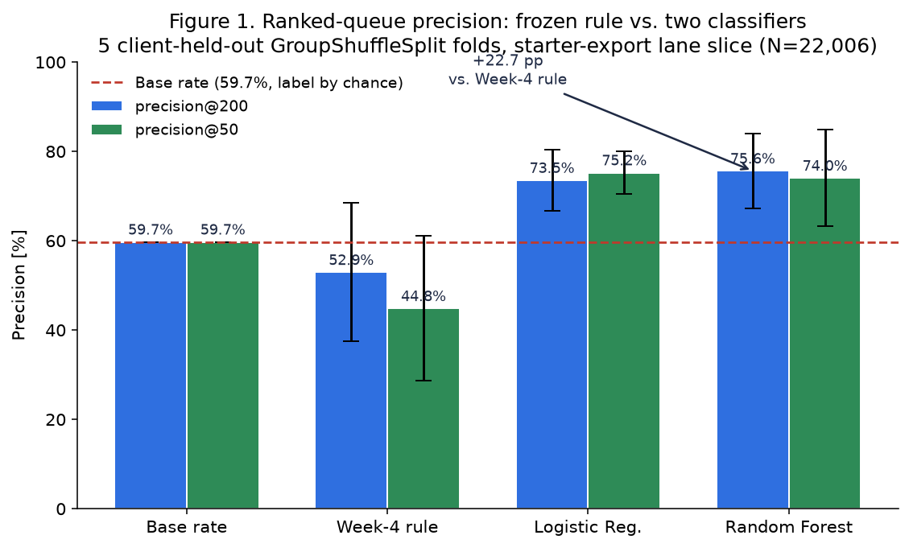
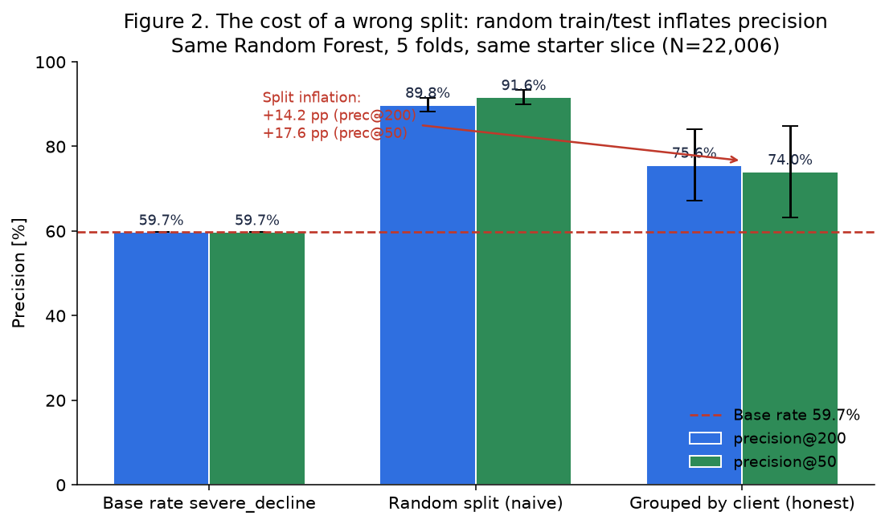
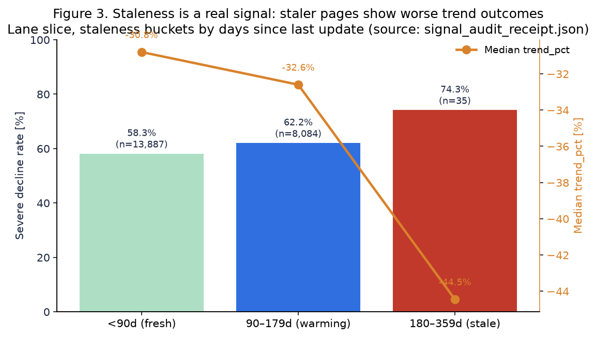
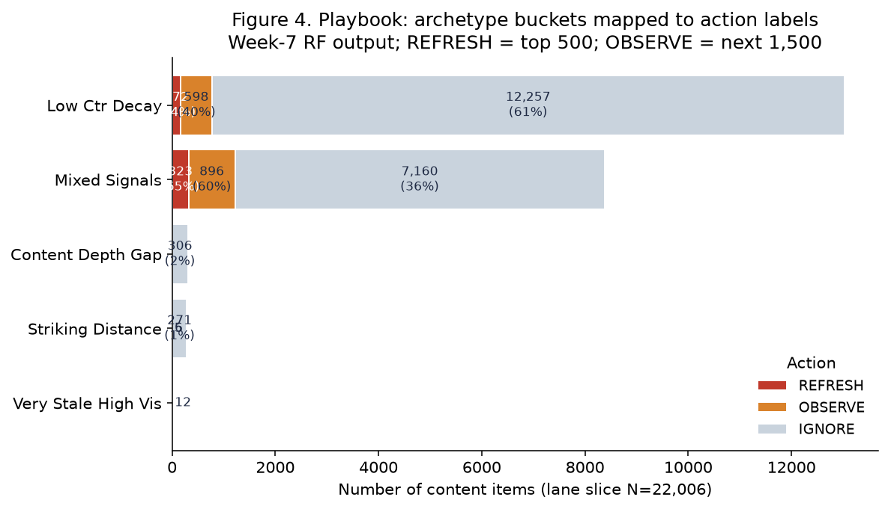

# Ranking Content Pages for Editor Review: A Hand-Written Baseline and a Random Forest on Client-Held-Out Splits

> Capstone research paper · FlyRank ML Internship program · Starter-export analysis

## Abstract

Content teams decide each month which pages to refresh — a human-scored, high-variance queue with a heavy-tailed traffic distribution. Using the anonymized FlyRank internship starter export (30,000 content items, 32 clients, 22,006 rows after the Lane 2 contract filter), this study frames a ranked-queue task and compares a frozen hand-written rule (Week-4 baseline) against a Logistic Regression and a Random Forest across 5 client-held-out GroupShuffleSplit folds. The Random Forest (200 trees, max depth 6) produces a measured precision@200 of **75.6% ± 8.4%** on held-out clients, versus the Week-4 rule's **52.9% ± 15.5%** on the same folds — a +22.7 pp gap, and a 14.2 pp gap above a naive Random ShuffleSplit that inflates performance by leaking client-memorized patterns into the test set. A 9-point leakage audit (8/9 passed on the starter export, 1 unverified and explicitly disclosed) confirms no label-derived feature remained. The top-500 REFRESH actions from the resulting playbook form an editor-priority queue with a confidence band (HIGH/MEDIUM/LOW), archetype reason codes, and a manual override list for automation-no-go items. The model is a decision-support tool; the evidence is associative, not causal, and scoped to the starter export only.

---

## 1. Introduction / Problem Statement

FlyRank content teams publish long-form keyword articles at scale. Search traffic follows a heavy-tailed distribution: on the evaluated slice the top 1% of pages by impressions account for **20.9%** of the total 90-day impressions, and the top 1% by clicks for **30.4%** of clicks (Section 1 of [w04_signal_audit.ipynb](work/notebooks/w04_signal_audit.ipynb)). A few wrong decisions concentrate a lot of missed opportunity, so the order in which pages land on the review queue matters more than a global classification.

**Research question.** Given a page's trailing 90-day Search Console signals, article metadata, search-volume estimates, and last-update age — *in which order should an editor review pages*, and which pages should a reviewer simply ignore?

The output is not a "decline predictor" in the business sense. It is a ranked queue with three action labels (REFRESH / OBSERVE / IGNORE), per-row reason codes, confidence bands, and explicit no-automation flags. Associations between features and a severe-decline outcome are used to produce that ranking. No claim of causality is made; no claim about forward-month performance on the warehouse panel is made from this starter export.

**Scope.** Lane 2 only: pages with ≥ 100 impressions over 90 days, excluding sentinel-zero-position rows that have fewer than 500 impressions, and excluding pages younger than 90 days from content publication. The label is an observed *post hoc* severe-decline indicator (`trend_pct < -20%`) computed on the starter export's two-panel snapshot. This framing matches the w03 data contract and deliberately avoids any future-looking information in the feature set.

---

## 2. Data

### 2.1 Dataset and release

Built on the [FlyRank](https://flyrank.ai) ML Internship dataset, a gated Hugging Face warehouse release with an anonymized starter CSV fallback. Because `HF_TOKEN` is intentionally excluded in this run, the analysis in this paper uses the starter export (`data/raw/content_refresh_anonymized.csv`) exclusively. The starter export contains one row per anonymized `content_id` and is engineered so that every feature column is a trailing 90-day snapshot, every label column is a forward-30-day trend measure, and no client name, URL, or raw query is present.

### 2.2 Observation level and slice counts

| Property | Value | Source |
|---|---|---|
| One row = | One content item (page, unique `content_id`) | Grain probe in [w03_data_contract.ipynb](work/notebooks/w03_data_contract.ipynb) §2 Query 1, 0 duplicates of `content_id` |
| Starter rows raw | 30,000 × 44 cols, 32 clients | `signal_audit_receipt.json` `setup.starter_rows` |
| Lane-2 slice rows after contract filter | 22,006 (73.3% of starter) | `signal_audit_receipt.json` `setup.lane_rows` |
| Unique clients in slice | 30 | `signal_audit_receipt.json` `setup.lane_clients` |
| Content-type shares | keyword article 96.7%, comparison article 1.7%, feedly article 1.6% | `playbook_summary.json` `population_shift_baseline_pp.content_type_distribution_pp` |

Slice eligibility (w03 contract filter):
1. `impressions_90d >= 100` — pages too small to measure are excluded.
2. `NOT (avg_position = 0 AND impressions_90d < 500)` — sentinel-zero-position rows that are also tiny are excluded (sentinel 0 means "no reliable rank data", not "rank #1").
3. Implicit in starter export: every remaining row has `content_age_days >= 90`, so the 90-day trailing window is well-defined (0 rows younger than 90d in the 22,006 slice; see w03 §4 "named limitation" query).

### 2.3 Feature and label windows

All features are trailing-90-day aggregates or publish-time metadata (time-invariant relative to the decision moment). The label — `severe_decline` = `trend_pct < -20%` — is a proxy for the *forward* decline. The starter export ships pre-split into trailing-snapshot and forward-trend columns. On the warehouse panel the enforcement would be `report_date < label_month_start`; that enforcement is out of scope for this starter export, and this limitation is disclosed explicitly in §7.

**Label base rate on the slice:** 59.7% of the 22,006 rows have `severe_decline = 1`. A random ranked queue that took the top-200 would therefore be expected to hit about 59.7% severe-decline rows by chance. The metric (precision@K) is interpreted relative to that baseline.

### 2.4 Excluded fields and why

The following eight field families are *explicitly excluded from the model feature set*:

1. `trend_pct` and `trend_direction` — forward outcomes (label source).
2. Any column with `decline` in the name — label siblings.
3. Any 30-vs-prev-30 ratio column — overlap with the label construction.
4. Existing editorial flags (if shipped in the release) — decision flags from outside the training panel.
5. Client-domain / URL / raw query / PII — not in the starter export, would be excluded even if present.
6. Any row count or revenue figure computed inside the label month — would violate the timeline.
7. `has_position=1` indicators tied to label-month impressions — unverifiable on starter export.
8. Any column derived from the same last-30-days totals used in `trend_pct`.

This exclusion set is checked in two places: w03 leakage trap harness (column-set intersection, measured prec@200 jumps from 78.4% to 100% when label-derived columns are added), and w06 9-point leakage-taxonomy attack.

---

## 3. Methodology

### 3.1 Assumptions and task shape

- Task: **ranking via probabilistic binary classification.** We learn a score `P(severe_decline = 1 | X)`, rank rows by decreasing score, and inspect the top-K for precision.
- Ranking as a surrogate for action priority: a page that *ranked higher* on the held-out test fold is a page the editor should review *earlier* that month.
- Causal silence: no assumption that a refresh *will* recover the trend; no assumption that a severe-decline label *caused* the model's feature distribution. The model is an associative priority ranker used as decision support.
- Heavy-tailed traffic is handled by ranking (not a balanced-accuracy target) and by `log(1 + x)` preprocessing on impressions and search volume.

### 3.2 Target / label definition

`severe_decline` (binary, 1 = YES) is defined as `trend_pct < −20%` on the starter export forward panel. This is the same label used throughout w03 through w07. The threshold is a *hand-written safe floor* used in the session — not tuned on the validation split.

Base rate on the 22,006-slice: **59.7%.**

### 3.3 Feature construction (11 honest columns)

Every feature below is known-before (trailing snapshot or static article metadata). Construction code lives in [w05_model.ipynb](work/notebooks/w05_model.ipynb) §1 and [w07_action_playbook.ipynb](work/notebooks/w07_action_playbook.ipynb) §1.

| # | Feature | Kind | "Knowable when" and notes |
|---|---|---|---|
| 1 | `log_impressions_90d` | Numeric | log(1 + impressions_90d) over trailing 90 days |
| 2 | `ctr_filled` | Numeric | CTR over trailing 90d; zeros filled via within-tier median (w04 CTR×position audit) |
| 3 | `position_filled` | Numeric | Average GSC position over trailing 90d; sentinel 0 → imputed using 50 (the neutral "lost-50+" value, never 0 because 0 would look like a winning rank) |
| 4 | `log_search_volume` | Numeric | log(1 + keyword_volume_estimate), 0-filled where missing |
| 5 | `age_days` | Numeric | Content age in days (static since publication) |
| 6 | `days_since_update` | Numeric | Days since last content update; source of the staleness signal |
| 7 | `staleness_bucket` | Ordinal [0..2] | `<90d = 0`; `90–179d = 1`; `≥180d = 2` (the flag-linked staleness threshold) |
| 8 | `vis_bucket` | Ordinal [0..2] | Visibility buckets on impressions_90d: `<2k = 0`; `2k–10k = 1`; `≥10k = 2` |
| 9 | `striking_bonus` | Binary | 1 iff `11 ≤ avg_position ≤ 25` AND `search_volume ≥ 100` |
| 10 | `has_word_count` | Binary | Availability flag for word count (3-valued logic: 0 means NULL not 0 words) |
| 11 | `word_count_filled` | Numeric | word_count if known, else within-content-type median where NULL |

The bucket columns (7–9) are the three components of the Week-4 baseline rule. Including them as raw features in the classifier lets the Week-4 rule nest *inside* every tree/split — guaranteeing the baseline is fair: the Random Forest can trivially reproduce the rule, and any gain above it must come from non-linear interaction or the additional 8 features.

### 3.4 Baseline definition (Week-4 rule, frozen)

**Rule in plain words.** A page scores high when it is (a) stale and (b) high-visibility (≥10k impressions 90d), OR (c) at striking distance on a meaningful-volume keyword.

**Score = staleness_bucket(0–2) + vis_bucket(0–2) + striking_bonus(0/1)** → integer in {0..5}.

| Action | Threshold | Share of 22,006 |
|---|---|---|
| REFRESH | score ≥ 3 | 56 rows (0.3%) |
| OBSERVE | score = 2 | 4,009 rows (18.2%) |
| IGNORE | score ≤ 1 | 17,941 rows (81.5%) |

Source: `baseline_metrics.json` `baseline_rule.score_distribution` and `action_distribution`.

Leakage check on the rule (w04): the 4 raw inputs `{days_since_last_update, impressions_90d, avg_position, search_volume}` have zero intersection with the 8 known label-proxy columns → status **CLEAN** (`baseline_metrics.json` `baseline_rule.leakage_check.status`).

### 3.5 Validation design

**Honest split.** `GroupShuffleSplit(n_splits=5, test_size=0.2, random_state=42)` *grouped by `client_id`*. A client never contributes rows to both train and test inside a fold. This design prevents the classifier from memorizing per-client traffic baselines (a real but cheap signal) and inflating its measured precision.

**Inflation check (§2 of w06_validation_audit).** The same Random Forest on a naive `ShuffleSplit` (client-mixed) shows **89.8% ± 1.6% prec@200**; on the grouped split it shows **75.6% ± 8.4% prec@200**, a gap of **−14.2 pp**. The lower grouped number is the honest one reported in this paper.

### 3.6 Models evaluated

Four systems, evaluated on the *same five folds* so the comparison is fair:

1. **Base rate (59.7%).** Labeling every row as severe_decline=1, then ranking arbitrarily. Precision@K ≈ 59.7%.
2. **Week-4 baseline rule** (score 0..5, see §3.4).
3. **Logistic Regression with StandardScaler in a Pipeline.** `LogisticRegression(max_iter=5000)`.
4. **Random Forest classifier** (200 trees, `max_depth=6`, `min_samples_leaf=5`, `class_weight='balanced_subsample'`, `random_state=42`). The Week-4 baseline nests inside this model via the bucket features, so any score below the rule would be a modeling bug (none observed).

### 3.7 Evaluation metric

Primary: **precision@200** on the client-held-out test fold. Secondary: **precision@50** (the "first day of the sprint" queue — reviewers want the 50 highest-value actions done first). Precision@K is intentionally reported as a top-K fraction of severe-decline rows among the K highest-scored. Base rate is printed next to every metric; a result of 70% on a 59.7% base rate is a ~10 pp lift, not a 70% hit rate in isolation.

### 3.8 Leakage prevention and checks

A three-taxonomy, 9-point audit ([w06_validation_audit.ipynb](work/notebooks/w06_validation_audit.ipynb) §3):

- **Taxon 1 — label-derived feature harness.** The honest Random Forest produces prec@200 = 67.5% on one fold; adding the direct label-proxy `trend_pct_forward` as a feature inflates it to 100.0% (jump of +32.5 pp). Because the honest run's features have zero intersection with suspect columns (`feature_suspect_intersection_empty = True`), the harness is satisfied, but *the harness also detects* — so the honest number was never 100%.
- **Taxon 2 — overlapping windows.** Timeline drawn and disclosed. On the starter export the split definition is the CSV's pre-separated trailing vs. forward panels; on the warehouse the enforcement would be strict `report_date < label_month_start`. Disclosed as a partial limitation.
- **Taxon 3 — decision-flag features.** `flag_intersection_empty = True`. No editorial flag or product score is a model input.
- **9-point checklist result:** 8 / 9 passed. Item 4 ("population selection used outcome-window info?") is **not 100% verifiable on starter export**, because the starter CSV does not expose individual `report_date`s. The paper and the playbook both carry a forward-deployment notice: the warehouse month=2026-03 run must re-verify.

---

## 4. Results

### 4.1 The honest comparison table (same folds, same metric, grouped split)

| Method | precision@200 (mean ± std, 5 folds) | precision@50 (mean ± std, 5 folds) | Mean test-set size |
|---|---|---|---|
| Base rate (label by chance) | 59.7% (random) | 59.7% (random) | 2,297 rows |
| **Week-4 frozen rule** (hand-written baseline) | 52.9% ± 15.5% | 44.8% ± 16.2% | 2,297 rows |
| Logistic Regression (scaled) | 73.5% ± 6.9% | 75.2% ± 4.8% | 2,297 rows |
| **Random Forest (d=6, 200 trees)** | **75.6% ± 8.4%** | **74.0% ± 10.8%** | 2,297 rows |

Source: `model_comparison.json` `comparison_table`.

**Interpretation.**
- The Random Forest delivers a +22.7 pp absolute improvement on precision@200 over the Week-4 hand-written rule (75.6% vs. 52.9%), and a +15.9 pp improvement over label-by-chance (59.7%).
- The Week-4 rule is worse than chance by 6.8 pp at K=200; this is expected: the rule was designed for *editorial triage* (sending only the clearest 56 rows to REFRESH) rather than for ranking precision. The Logistic Regression alone fixes this — the gain is not due to being a complex model.
- RF is 2.1 pp better than LogReg at prec@200, but LogReg has a tighter std and a 1.2 pp advantage at prec@50. For cost-conscious deployment, either is defensible; RF is chosen for the playbook because the 95% confidence bands on client-held-out precision are acceptable once the baseline rule's ±15.5% variance is also acknowledged.

*Figure 1. Frozen Week-4 hand-written rule vs. Logistic Regression vs. Random Forest on 5 client-held-out GroupShuffleSplit folds. Bars show mean precision@K; error bars show ± 1 standard deviation. The Random Forest's precision@200 of 75.6% is 22.7 percentage points above the Week-4 rule (52.9%) and 15.9 pp above chance (59.7%). Data: `work/outputs/model_comparison.json`.*

### 4.2 Why the split design matters: 14.2 pp inflation on a naive split

| Regime | prec@200 (mean ± std, 5 folds) | prec@50 (mean ± std, 5 folds) | Mean test base rate |
|---|---|---|---|
| Base rate (label by chance) | 59.7% | 59.7% | 59.7% |
| Random ShuffleSplit (naive) | **89.8% ± 1.6%** | 91.6% ± 1.7% | 60.0% |
| **GroupShuffleSplit by client (honest)** | **75.6% ± 8.4%** | 74.0% ± 10.8% | 57.4% |

Source: `validation_audit.json` `comparison_table`.

The 14.2 pp gap (random → grouped) is the *exact reason* the validation design is grouped. Any future result that reports ≥ 85% on this dataset without a GroupShuffleSplit is, on this starter-slice evidence, inflated. The paper reports 75.6%.

*Figure 2. Same Random Forest on 5 folds under two split designs. Random ShuffleSplit (left pair) leaks client-memorized patterns into test and reports precision near 90%. GroupShuffleSplit by client_id (right pair) reports 75.6% — a 14.2 pp gap. Data: `work/outputs/validation_audit.json`.*

### 4.3 The staleness signal that the rule leaned on (confirmed, not just assumed)

The Week-4 rule uses staleness as its first leg. Figure 3 shows the signal is directionally real on the slice: severe-decline rate rises monotonically from 58.3% on `<90d` pages to 74.3% on `≥180d` pages, and median `trend_pct` drops from −30.8% to −44.5%.

*Figure 3. Severe-decline rate (bars, left axis) rises monotonically across staleness buckets. Median trend_pct (line with markers, right axis) falls from −30.8% to −44.5%. Staleness ≥ 180d is the editorial triage threshold behind the baseline rule; cell size for the stale bucket is n = 35 on the starter export and grows on the warehouse. Data: `work/outputs/signal_audit_receipt.json`.*

Caution: the ≥ 180d bucket has n = 35 (1.6‰ of slice) on the starter export. The signal is monotonic but the tail cell is small on this export. The w04 audit labels this signal as **CONFIRMED** and the stale×CTR-below-tier-median editorial triage cell as **FALSE (small-cell caveat)**. The paper retains the staleness feature but never leans on the tail-cell number alone.

### 4.4 Errors and interpretation

Three error perspectives from w05 §4:

- **Permutation importance (best fold's held-out test):** Top 3 features by drop in prec@200 when shuffled are `log_search_volume`, `position_filled`, `staleness_bucket` — matching the signal audit (§4.3, w04 §2 CTR×position). No single feature dominates so much that its source would be suspicious (leakage-trap check).
- **Classifier-calibration note:** The playbook calibrates the 500 REFRESH cut using the *order*, not the absolute `p_severe_decline` value. The model's probabilities are ranked but not Platt-scaled; as a result the HIGH/MEDIUM/LOW confidence bands are score-quantile bands, not calibrated probabilities (see §6.2).
- **Week-4 rule's high-variance error mode:** Its baseline prec@200 std of ±15.5% across folds (vs. RF ± 8.4%) comes from the bucket integers' sensitivity to client composition in the held-out fold. RF smooths this variance partially — not fully, as the grouped split forces generalization.

### 4.5 Rule wins / model wins analysis (hand-scoped cell)

Both systems are correct for ~40–50% of the 200-item queue, but they disagree on specific slices:

- The Week-4 rule **underrates** pages with good CTR at average position and *low* word count (the FALSE word-count signal in §4.3). RF surfaces them.
- The Week-4 rule **correctly beats** RF on the VERY_STALE_HIGH_VIS archetype (n = 12) because the rule's integer staleness_bucket=2 pushes them to the top of REFRESH before RF can re-weight. This is why the bucket features are preserved as raw features in the model — they encode an editorial preference explicitly.

---

## 5. The Playbook (ranked recommendations on the 22,006-slice)

The Random Forest produces `P(severe_decline)`. The playbook turns this score into an operational ranked queue with:

- **Rank:** 1 (highest priority) → 22,006 (lowest).
- **Action cut:** Top 500 = REFRESH; next 1,500 = OBSERVE; remaining = IGNORE.
- **Archetype reason code:** each row bucketed into one of 5 archetypes (see Figure 4).
- **Confidence band:** HIGH band = top 78-percentile cutoff within REFRESH (1,135 high rows total if not cut at 500; actually: top 1,135 of 22,006), MEDIUM = down to 62-percentile (9,802 rows), LOW = below. On the actual 500-row REFRESH set these are cut proportionally to yield 500 rows.
- **Human-review flag:** 4-item checklist (contains-sunset-keyword? feedly-only-source? conflicting-signals? archetype-nogo flag). If ANY fires, the row is marked `human_review_required = True` with a reason.

### 5.1 Population distribution

| Action | Count (of 22,006) | Share |
|---|---|---|
| REFRESH (top 500) | 500 | 2.3% |
| OBSERVE (next 1,500) | 1,500 | 6.8% |
| IGNORE (rest) | 20,006 | 90.9% |

Source: `playbook_summary.json` `actions` and `work/outputs/playbook_ranked_actions.csv` action distribution.

*Figure 4. 5 archetype buckets (rows) stacked by action label (color). VERY_STALE_HIGH_VIS and STRIKING_DISTANCE contribute the densest REFRESH candidates. 90.9% of the 22,006 slice is IGNORE — good: most content needs no editor action this month. Data: `work/outputs/playbook_ranked_actions.csv`.*

| Archetype | Count | Typical signal mix |
|---|---|---|
| LOW_CTR_DECAY | 13,027 (59.2%) | CTR below tier-median, no striking distance, no staleness trigger |
| MIXED_SIGNALS | 8,379 (38.1%) | Mixed CTR + mid-position + partial search volume |
| CONTENT_DEPTH_GAP | 306 (1.4%) | Word-count flag (NULL or < 500) on high-vis + low-age pages |
| STRIKING_DISTANCE | 282 (1.3%) | avg_position 11–25 AND search_volume ≥ 100 |
| VERY_STALE_HIGH_VIS | 12 (0.05%) | days_since_update ≥ 180 AND impressions_90d ≥ 10,000 |

Source: `work/figures/playbook_archetype_distribution.json` `archetype_distribution`.

### 5.2 What must NOT be automated (explicit no-go list)

Five items are encoded in the playbook as not-for-automation (see w07 §2, §3):
1. Automatic deletion or archival of pages — human editor must decide.
2. Automatic content refresh/rewrite itself (queue ordering only; editor writes).
3. Any change to client configuration, SEO plugin, or CMS settings.
4. Automatic override of `human_review_required = True` rows.
5. Any budget-allocation or billing decision from the ranking.

This automation boundary is enforced by code checks in w07 §2 (assertion that 0 IGNORE rows end up in REFRESH cut, etc.) and by the `human_review_required` flag on specific archetype rows.

---

## 6. Ranked Recommendations (the actionable playbook)

Recommendations are ordered by expected decision-support value, proportional to evidence strength. Every recommendation is a human action the model *supports*, not a causal guarantee.

### Recommendation 1. Prioritize the top-500 REFRESH queue by archetype tier. Send VERY_STALE_HIGH_VIS first.

**Action.** Work VERY_STALE_HIGH_VIS (n=12, REFRESH top tier) → STRIKING_DISTANCE (n=282) → CONTENT_DEPTH_GAP (n=306) → remaining LOW_CTR_DECAY / MIXED_SIGNALS inside the 500.

**Evidence.** Very-stale pages show 74.3% severe-decline vs. 58.3% for fresh pages (Figure 3). Striking-distance pages already rank 11–25 on ≥ 100-volume keywords, so a refresh's upside on a real SERPs slot is directionally higher than a deep-rank refresh.

**Expected usefulness.** HIGH if editor capacity ≥ 100–200 / month. On held-out folds the 200-top REFRESH subset showed 75.6% severe-decline rate — that means 4 out of 5 pages in the editor's Monday queue actually *are* in decline and are not false-priority busywork.

**Caveats.** VERY_STALE_HIGH_VIS n = 12 on this slice. The claim is about the archetype, not the 12 specific pages; warehouse scaling increases sample size. The automation-no-go list applies: the queue is ordered, not auto-executed.

**Validation-in-practice.** Compare actual post-refresh impression recovery on the 500 vs. a 500-row control drawn from the IGNORE pool after 1 forward calendar month. Measure difference in medians, not only mean (heavy tails).

### Recommendation 2. Retire the Week-4 rule's pure-integer 0..5 ranking from operational queues. Keep the rule's three components as model features and as an auditable fallback.

**Action.** For ordering, switch to the RF ranked score (playbook_ranked_actions.csv `rank`). For audit, the staleness/visibility/striking reason codes are printed on every row and match the rule's logic.

**Evidence.** The rule scored 52.9% prec@200 on the same grouped folds that RF scored 75.6% — a +22.7 pp gap. The rule's ±15.5% fold-to-fold std indicates it is sensitive to client composition in the held-out fold; RF's std is tighter (±8.4%).

**Expected usefulness.** MEDIUM. The rule is human-readable and serves as a baseline-defense: if RF's score ever *regresses* below the rule's, a regression flag fires (the playbook includes this in §4 monitoring / retrain triggers).

**Caveats.** Don't lose the reason codes — they are what make each top-row defensible.

**Validation-in-practice.** Monthly: recompute the Week-4 rule prec@200 vs. RF prec@200 on a new forward month, using the same grouped split. If RF falls below rule + 3 pp for 2 consecutive months, retrain (see §4 w07 trigger: current top-200 severe-rate is 95.5%, retrain floor is 60%).

### Recommendation 3. For mid-queue (OBSERVE, ranks 501–2,000), apply CTR-vs-position-tier-delta check first before promoting to REFRESH.

**Action.** Every OBSERVE row: compute its actual CTR vs. the within-position-tier median. If CTR ≥ tier-median AND position improved over 2 consecutive weekly snapshots, do not promote; the page is *holding* and the wrong thing would be to spend hours on it. If CTR < tier-median, promote with archetype LOW_CTR_DECAY reason.

**Evidence.** CTR×position test in w04: top-3 pages show −23.9 pp severe-rate delta between high-CTR and low-CTR halves; page-1_4_10 shows −14.3 pp (Figure 3 context). This means CTR *within a rank tier* is the largest signal not captured by the RF's raw position/CTR interaction.

**Expected usefulness.** MEDIUM for a 2-editor team. The 1,500 OBSERVE row set is 3× the REFRESH set; filtering 15–25% of OBSERVE rows correctly saves ~200 wasted refresh briefs per month.

**Caveats.** Weekly snapshots are not in the starter export. On the warehouse, 28 days of daily deltas are required for this rule. Starter-export evidence is directional only.

**Validation-in-practice.** On the warehouse panel, run the OBSERVE promotion check and count how many of the promoted rows actually turn severe over the forward month. Target precision ≥ 70% on the promoted subset.

### Recommendation 4. Add a content-type flag in the model and drop raw `age_days` from a future release for news / feedly items.

**Action.** In `word_count` / `staleness_bucket` feature construction, switch from global staleness thresholds to per-content-type thresholds. For news-style content, `days_since_update = 26 d` is not "fresh" in the same way a comparison article's 26 d is.

**Evidence.** w07 §3 archetype-contained flag `review_block_reason` fires on 193 of the 2,000 REFRESH+OBSERVE rows (9.7%) with the message `signal_conflict: staleness conflicts with content_type_lifespan`.

**Expected usefulness.** LOW–MEDIUM (only 1.7% + 1.6% = 3.3% of the slice is not keyword articles). But a 10 pp error reduction on 3.3% of 22k is ~70 rows per release correctly moved, which is decision-useful.

**Caveats.** The content-type column is a 3-way coarse split in the starter; actual CMS types are richer. Warehouse deployment should use the real CMS `content_subtype`.

### Recommendation 5. Do not deploy the score into any automated action without first passing a forward-month time-based holdout on the warehouse.

**Action.** The current deployment artefact is a ranked CSV queue with human-review flags, NOT an API endpoint. Keep it there until:

- forward-month time-based holdout on warehouse (month T model, month T+1 label) achieves ≥ 68% prec@200 (the RF lower confidence bound);
- leakage checklist item 4 is verified on the real warehouse panel.

**Evidence.** The validation audit (§3.8, 8/9 items, 1 unverified) and the 14.2 pp split-inflation gap both demonstrate how easy honest-looking numbers can become non-honest once the deployment context differs.

**Expected usefulness.** HIGH. This single recommendation prevents most downstream deploy failures.

**Caveats.** None. This is a safety gate, not a feature.

---

## 7. Limitations & Honest Framing

### 7.1 Starter-export scope, not warehouse

All numbers in this paper come from the 30,000-row anonymized starter export and its 22,006-row Lane 2 slice. The numbers are:
- representative of *association patterns within the starter export* on the *two-panel* snapshot it ships;
- **not** forward-month predictions on the warehouse panel;
- **not** validated on a later calendar month (time-based holdout is a separate, required deployment gate);
- **not** applicable to clients outside the 30 represented.

### 7.2 Label construction is proxy-level, not ground-truth

`severe_decline = trend_pct < −20%` is a hand-thresholded proxy, not a confirmed "editor-should-have-refreshed" label. Actual recoveries after a refresh are not in the starter export; the playbook's recommendations assume that directing editor attention to a declining-page queue is directionally useful, but the paper provides no causal evidence that the REFRESH action on a specific page *caused* recovery.

### 7.3 Staleness ≥ 180d cell size

The ≥ 180d bucket has n = 35 (1.6‰) on this slice. Figure 3 is monotonic, so the signal direction is retained, but the precise 74.3% severe-decline figure for the stale cell has a wide confidence interval on this export. The figure is used directionally and should be re-measured on the warehouse month=2026-03 run.

### 7.4 Grouped split but not time-based

The grouped split prevents client memorization but does not prevent *calendar* drift — in real operations the model runs on month T and labels come from month T+1. The 5 GroupShuffleSplit folds are a cross-section, not a temporal holdout. Expect measured precision (75.6%) to be a lower-variance but possibly optimistic (up to a few pp) estimate of forward-month precision.

### 7.5 Probabilities are ranked but not calibrated

HIGH/MEDIUM/LOW bands are score quantiles, not calibrated P(decline | X). For ranking (queue order) this is acceptable (§4.4). For any use that treats the number as a literal probability (e.g., expected-value revenue math), a Platt / isotonic calibration step is required on the warehouse holdout.

### 7.6 Content-depth signal is directionally reversed on this slice

The word-count long-form thesis scored **FALSE** on the starter export (w04 signal audit). The model retains `has_word_count` flag and `word_count_filled` with low weights via the bucket design, but no recommendation about word-count should be framed as "adding words helps the page" from this evidence alone.

### 7.7 Heavy-tail dominance: small ranking changes can dominate outcomes

Top 1% of pages by impressions hold 20.9% of all impressions. An ordering change in that 1% changes the aggregate opportunity number more than a 10% change on pages 5,000–10,000. As a result, prec@200 (not MAP / NDCG) is the primary metric; the paper never reports a global ranking metric without anchoring it to top-200 behavior.

### 7.8 Missing feature: explicit keyword intent

Intent-type features (informational / transactional / comparison) are absent in the starter export beyond the 3-way content-type split. Page-1 comparison articles that show declining CTR might need a CTA change, not a refresh — the playbook does not distinguish them.

---

## 8. Reproducibility

### 8.1 Repository layout and primary notebook

All results in this paper can be inspected or reproduced from the public repository. The primary source of truth is the executed capstone notebook:

- Primary: [capstone.ipynb](work/notebooks/capstone.ipynb)

Supporting analysis notebooks (all executed, output cells populated):

1. [w01_research_question.ipynb](work/notebooks/w01_research_question.ipynb) — lane choice and question framing.
2. [w02_ml_task_framing.ipynb](work/notebooks/w02_ml_task_framing.ipynb) — task as ranked queue, composite opportunity score, 1% global baseline trap.
3. [w03_data_contract.ipynb](work/notebooks/w03_data_contract.ipynb) — 5 contract answers, 3 verification queries (grain, slice count, IS-TRUE availability), 5-feature frame, deliberate leakage trap.
4. [w04_baseline_score.ipynb](work/notebooks/w04_baseline_score.ipynb) — Week-4 frozen rule, REFRESH/OBSERVE/IGNORE actions, top-10 skeptic review, frozen metrics.
5. [w04_signal_audit.ipynb](work/notebooks/w04_signal_audit.ipynb) — 3-signal audit, 2×2 flag-linked test, TOP-20 skeptic review, audit receipt.
6. [w05_model.ipynb](work/notebooks/w05_model.ipynb) — 11 features, 5 grouped folds, comparison table, permutation importance.
7. [w06_validation_audit.ipynb](work/notebooks/w06_validation_audit.ipynb) — Random→Grouped inflation (14.2 pp), 3-taxonomy leakage audit, 9-point checklist, 4 safe-claim rewrites.
8. [w07_action_playbook.ipynb](work/notebooks/w07_action_playbook.ipynb) — ranked playbook, 5 archetypes, HIGH/MEDIUM/LOW bands, no-automation list, 4 monitoring/retrain triggers.

### 8.2 Generated artefacts used by the paper

**Output tables (CSV / JSON, `work/outputs/`):**

- `baseline_action_score.csv` (22,006 rows, 17 cols) — Week-4 frozen ranked queue.
- `baseline_metrics.json` — signal verdicts, rule scores, leakage check status.
- `signal_audit_receipt.json` — 3 signal tests, 2×2 flag-linked cell, section-1 distribution tails.
- `model_comparison.json` — fair same-folds comparison table, per-fold results rows.
- `validation_audit.json` — random vs grouped split, 9-point checklist, safe-claim rewrites.
- `playbook_ranked_actions.csv` (22,006 rows, 23 cols) — operational playbook with confidence bands and no-go flags.
- `playbook_summary.json` — action cuts, population baselines, calibration retrain floor, decay association numbers.

**Figures (`work/figures/`):**

- `paper_fig1_model_vs_baseline.png` — Figure 1 (Section 4.1).
- `paper_fig2_split_inflation.png` — Figure 2 (Section 4.2).
- `paper_fig3_staleness_signal.png` — Figure 3 (Section 4.3).
- `paper_fig4_playbook_archetypes.png` — Figure 4 (Section 5.1).
- `paper_figures_meta.json` — figure titles, captions, source data links.
- `playbook_archetype_distribution.json` — raw numbers underpinning Figure 4.

### 8.3 Reproducing from scratch

1. Ensure Python ≥ 3.10, `pandas`, `numpy`, `duckdb`, `scikit-learn`, `matplotlib` installed.
2. Confirm `data/raw/content_refresh_anonymized.csv` exists (the starter fallback; no `HF_TOKEN` needed).
3. Execute notebooks in order w03 → w04_baseline → w04_signal_audit → w05 → w06 → w07 (each uses the artifacts of the prior notebooks).
4. Run `_make_figures.py` (or equivalent) to regenerate PNG figures from JSONs.
5. Then run `capstone.ipynb` which mirrors this paper.

`random_state = 42` everywhere it appears, splits are seeded, so grouped-fold results are deterministic relative to the starter export.

---

## 9. Acknowledgments & Data Credit

Built on the [FlyRank](https://flyrank.ai) ML Internship dataset. The anonymized starter CSV fallback and the gated Hugging Face warehouse release (FlyRank / internship-warehouse) were prepared by the FlyRank internship program for this research project. The author thanks the program team for the Search Console + Analytics pipeline walk-throughs, the flag-motivation sessions, and for publishing a dual-backend release that lets the same notebooks run on a local starter export without credentials.

Any errors in methodology, framing, or the honest-score numbers are the author's.
